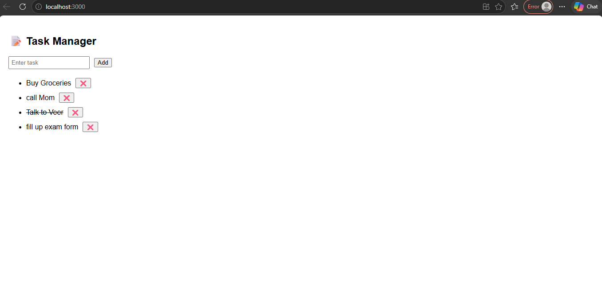

📝 Task Manager App
A simple and elegant Task Manager built with React to help you organize your daily tasks efficiently.

🌟 Features

* ✅ Add tasks
* 🗑️ Delete tasks
* 📋 View tasks instantly
* ⚡ Fast and responsive
* 🎯 Clean UI

🛠️ Tech Stack

* ⚛️ React.js
* 💻 JavaScript
* 🎨 CSS

📸 Screenshot



⚙️ Installation

```bash
git clone https://github.com/Kavya2502/Task-Manager-App.git
cd Task-Manager-App
npm install
npm start
```

📂 Folder Structure

```
src/
 ├── App.js
 ├── index.js
 ├── App.css
```
🧠 Assumptions & Trade-offs

- This implementation focuses on core functionality (adding tasks) without advanced features like authentication or task editing/deletion.
- A simple backend setup is used to keep the application lightweight and easy to understand.
- Minimal styling is applied, prioritizing functionality over UI design.
- Basic error handling is included; edge cases and validations are kept simple for brevity.
- Assumed the app will run locally with the frontend and backend on standard ports.

👩‍💻 Author

Kavya
🔗 https://github.com/Kavya2502
